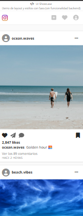

# Instafake UI

A UI showcase project simulating an Instagram-style social media interface. Built with focus on layout precision, responsive design, and modern CSS techniques.

---

## 🌐 Live Demo

👉 [https://instafake-ui.vercel.app/](https://instafake-ui.vercel.app/)

---

## 📱 Screenshots

### Desktop View


### Mobile View


### Post Detail


---

## 🎯 About This Project

**Instafake UI** is a frontend showcase project that demonstrates:

- **Layout mastery**: Recreating a familiar social media interface
- **CSS/Sass expertise**: Component-based styling with SCSS
- **Responsive design**: Seamless experience across all devices
- **Attention to detail**: Micro-interactions and visual polish

> This is a **UI-only demo**. No backend functionality is implemented. The focus is entirely on frontend design and development skills.

---

## ✨ Features

- 📱 **Responsive Layout** — Optimized for mobile, tablet, and desktop
- 🎨 **Component-based CSS** — Clean architecture using Sass/SCSS
- 🧩 **Reusable UI Patterns** — Cards, navbar, action buttons
- ⚡ **Micro-interactions** — Like and save button animations
- 📐 **Modern Layout Techniques** — Flexbox and CSS Grid
- 🔍 **Accessibility** — Semantic HTML and ARIA labels

---

## ⚙️ Tech Stack

| Technology | Purpose |
|------------|---------|
| HTML5 | Semantic markup |
| CSS3 | Styling and animations |
| Sass (SCSS) | Component-based styles |
| JavaScript | Micro-interactions |
| Font Awesome | Icon library |

---

## 🗂️ Project Structure

```
├── index.html          # Main page
├── css/
│   └── Instagram.css   # Compiled styles
├── Sass/               # SCSS source files
│   ├── _base.scss
│   ├── _cards.scss
│   ├── _variables.scss
│   └── Instagram.scss
├── js/
│   └── interactions.js # Like/save interactions
├── data/               # Images
└── README.md
```

---

## 🎓 What This Project Demonstrates

- **CSS Architecture**: Organizing styles into maintainable modules
- **Visual Hierarchy**: Creating clear information architecture
- **Design Fidelity**: Accurately reproducing a known interface
- **Code Quality**: Clean, well-structured, readable code

---

## 👩‍💻 Author

**María Brown**  
Frontend Developer

- GitHub: [github.com/MarayaBrown](https://github.com/MarayaBrown)
- LinkedIn: [linkedin.com/in/brownmaria](https://www.linkedin.com/in/brownmar%C3%ADa/)

---

## 📝 Note

This project focuses on frontend UI/UX skills, complementing more logic-driven applications in the portfolio. It showcases the ability to translate design mockups into pixel-perfect code.
